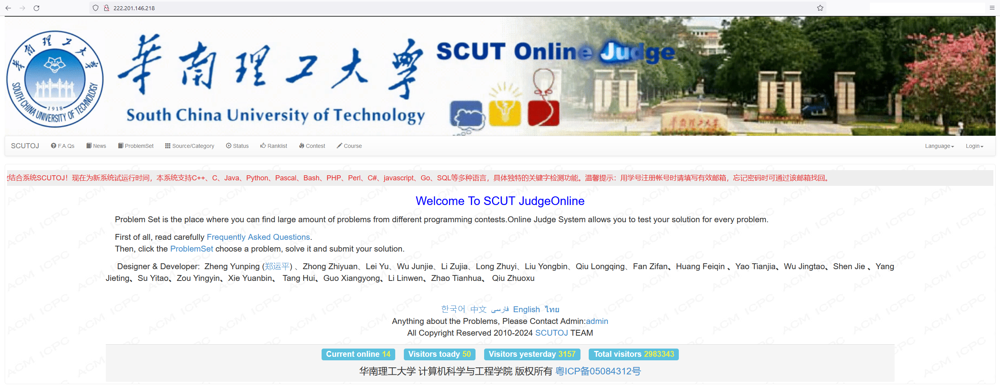

#summary 公布那些基于HUSTOJ却没有明确表明的论文与系统
#labels Featured

[http://hustoj.googlecode.com/files/OnlineJudge%E7%B3%BB%E7%BB%9F%E7%9A%84%E4%BC%98%E5%8C%96-mask.pdf 论文1]

该文所述SIEOJ其中相当数量的代码基于HUSTOJ,而其论文中却没有任何提及。

文中 judged judge_client 为HUSTOJ判题核心主体程序，题目转换XML为FreeProblemSet格式，基于SIM的抄袭检测也是属于HUSTOJ先使用作者系统后直接移植。

Online Judge系统的优化①
 

*鉴于作者来信致歉，并且表明杂志社因篇幅原因删去原有的包含hustoj的致谢内容，此处暂隐去作者姓名*  issue58

[http://hustoj.googlecode.com/files/sie-hustoj.png]

华南理工大学的[SCUTOJ](http://222.201.146.218/)(内网)完全基于HUSTOJ, 但在其首页却标注开发者为某本校副教授和一系列其他人

>Designer & Developer:             Zheng Yunping ([郑运平](http://www2.scut.edu.cn/cs/2017/0129/c22285a327655/page.htm))            、Zhong Zhiyuan、Lei Yu、Wu Junjie、Li Zujia、Long Zhuyi、Liu Yongbin、Qiu Longqing、Fan Zifan**、**Huang Feiqin            **、**Yao Tianjia**、**Wu Jingtao**、**Shen Jie            **、**Yang Jieting**、**Su Yitao**、**Zou Yingyin**、**Xie Yuanbin**、**            Tang Hui**、**Guo Xiangyong**、**Li Linwen**、**Zhao Tianhua**、**            Qiu Zhuoxu

甚至在其页脚标注"华南理工大学 计算机科学与工程学院 版权所有"

